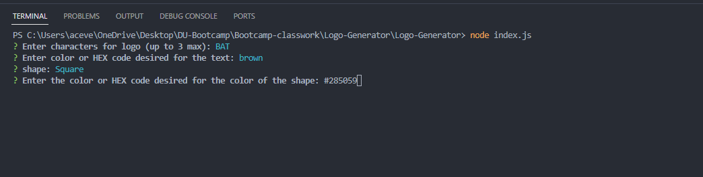

# Logo-Generator

https://drive.google.com/file/d/15MuPqBEhd8nks3nwPdIg3-UCHX_GEXxN/view

## Description
The motive behind this project was to create a program that would help me create logos faster without having to manually generate and spend time doing such task. While working on this project there was a lot of things I had to learn along the way to make sure the program ran the way it was supposed to. The biggest learning curve was referencing the files in the 'lib' folder to also talk/run inside the index.js file. It was a lot of time reading on how to make sure the shape could be rendered (shape dimensions) but then realizing that the code for the triangle was already provided in the triangle test requirement. Lastly, I learned the importance of spelling on the consts being referenced since spelling tripped me up for some time on the 'SVG' causing my code to not run properly and almost restarting entirely. 

## Table of Contents
-[Descriptions](#Descriptions)
-[Installation](#Installation)
-[Usage](#Usage)
-[Credits](#Credits)
-[Tests](#Tests)
-[License](#License)
-[Questions](##Questions)

## Installation
In order to install this project you will have to clone the repository: 
    1. Create a place where you will want to store all this information 
    2. Once there open GitBash
    3. Clone this repository into the file you will have this stored in
            enter following: git@github.com:juanthtgotaway/Logo-Generator.git
    4. Press enter to create your local clone

## Usage
This can be used to Create basic logos 

## Credits
https://www.w3schools.com/js/js_arrow_function.asp
https://developer.mozilla.org/en-US/docs/Web/SVG/Tutorial
https://developer.mozilla.org/en-US/docs/Web/SVG/Tutorial/Texts
https://jestjs.io/docs/getting-started
Re-watching class work videos over and over

## Tests
In this assignment I had to create a test to make sure the shape and shape color would generate. I tested with color and hex code to make sure numbers and letters would run just fine. 
The best way to run this is to left click on the lib folder and open in terminal. 
Then you can type inside terminal: 'npm test'
This will prompt to run tests and if something is off it will display it in terminal. 

## License
MIT

## Questions
If you have any questions or concerns feel free to reach out via the following:
GitHub:[juanthtgotaway](https://github.com/juanthtgotaway)